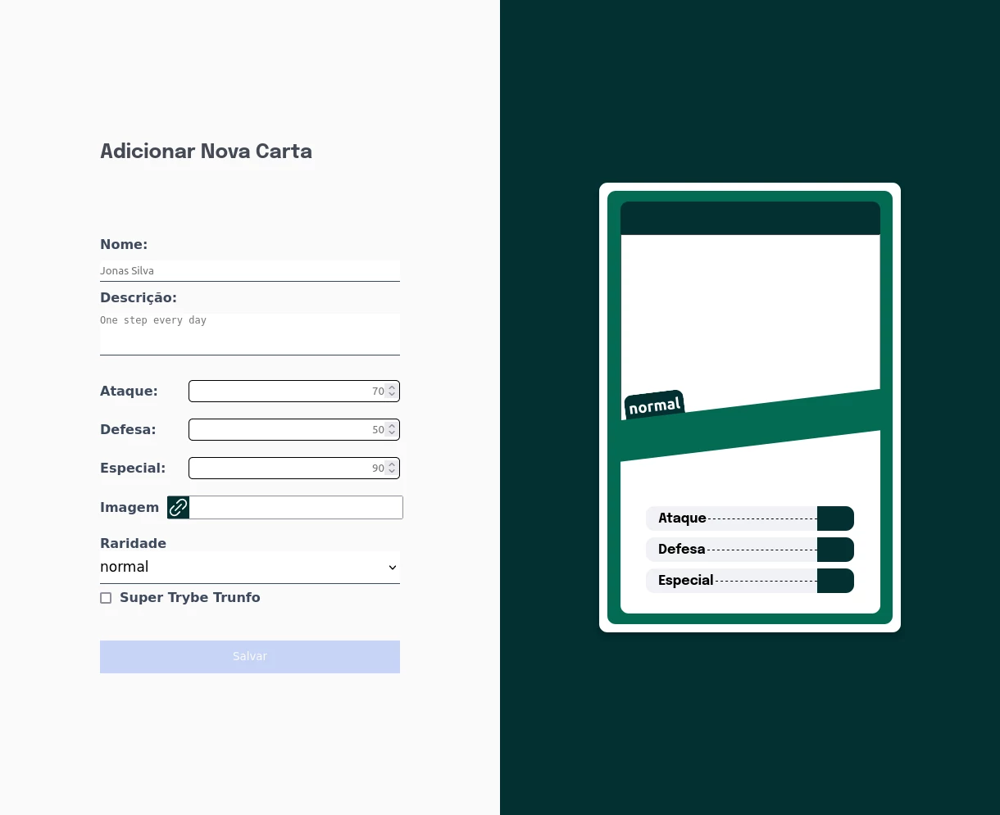
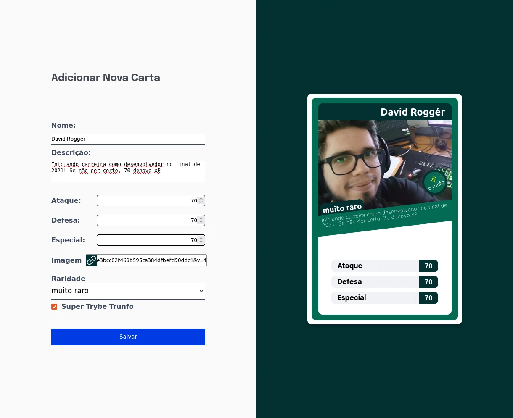
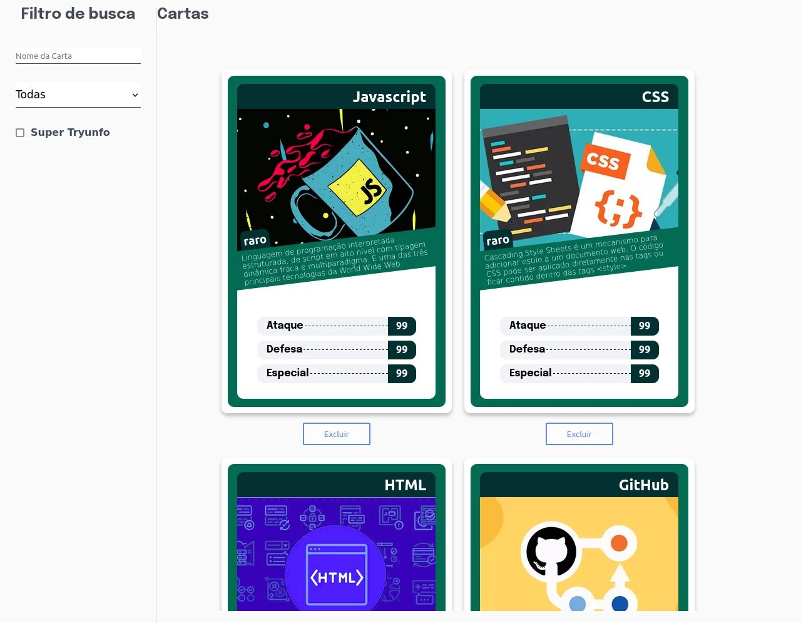

# Sobre

## Seção: `Componentes com Estado, Eventos e Formulários`
- Seção, apresentando mais sobre o uso de compoentes agora usando o estado na classe, para armazenarmos informações dinâmicas por meio dos eventos, sobre um formuário controlado.
#

  

>*clique na imagem para acesso online do projeto*
#
## Projeto: `Tryunfo`
- Projeto onde usamos tecnicas de passar estados entre componentes, para criarmos eventos onde precisavamos armazenar algum tipo de informação modificando-a. Criando um controle de estado por meio do formulário.

# Tecnologias e ferramentas usadas 🛠

# Desafios

- Criar de forma manual, validações de preenchimento de campo na "unha" para cada campo, validando a possibilidade de salvar a carta. Entender como cada componente tem limitação de visibilidade sobre outro.

# Conclusão

- Usamos conforme ensinado na seção a manipulação do estado e controle, de uma forma que conforme pesquisei mais sobre, é uma forma péssima, para desempenho, sendo muito melhor usar alguma biblioteca ou validar de alguma outra forma em tempo real por conta de suas múltiplas renderizações em tempo real, mas a ideia era mais entendermos o funcionamento do estado e como funcionava a transmissão entre componentes.

  

    <strong>
      :newspaper_roll: Requisitos solicitados durante o desenvolvimento do projeto
    </strong>
  

 
### Requisitos
*Nome* | *Avaliação*
--- | :---:
1 - Crie o formulário que será usado para adicionar cartas ao baralho | :heavy_check_mark:
2 - Adicione as props necessárias ao componente de formulário | :heavy_check_mark:
3 - Crie e renderize o componente Card com as props necessárias | :heavy_check_mark:
4 - Crie o preview da carta que está sendo criada pelo formulário | :heavy_check_mark:
5 - Faça a validação do botão de Salvar no formulário | :heavy_check_mark:
6 - Crie a função do botão salvar | :heavy_check_mark:
7 - Crie a validação do Super Trunfo | :heavy_check_mark:
8 - Exiba a lista de cartas que estão salvas no estado | :heavy_check_mark:
9 - Crie um botão para remover uma carta do baralho | :heavy_check_mark:
10 - Crie o filtro pelo nome da carta | :heavy_check_mark:
11 - Crie o filtro por raridade da carta | :heavy_check_mark:
12 - Crie o filtro de Super Trunfo | :heavy_check_mark:

#

